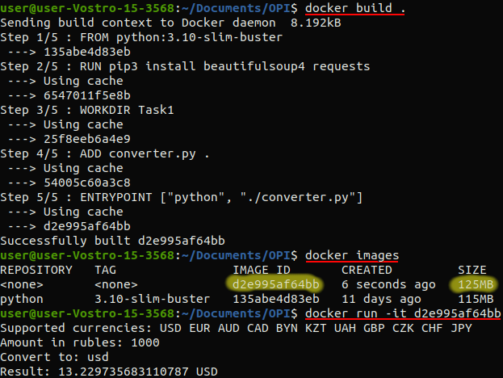

# Основы программной инженерии  
## Задание 1: конвертер из рублей в другие валюты  

В рамках данного задания был разработан python скрипт для конвертации суммы из рублей в другие валюты (доллар США, евро, австралийский доллар, каннадский доллар, белорусский рубль, казахстанский тенге, украинская гривна, британский фунт, чешская крона, швейцарский франк и японская иена).  

Скрипт работает следующим образом:  
* считывает сумму в рублях
* считывает название валюты, в которую нужно конвертировать
* парсит веб-страницу (https://www.banki.ru/products/currency/cb/) с целью получения актуального курса требуемой валюты
* выводит результат

Пример работы:  
```
>>>python converter.py
Supported currencies: USD EUR AUD CAD BYN KZT UAH GBP CZK CHF JPY
Amount in rubles: 100
Сonvert to: usd
Result: 1.3229735683110788 USD
```

Запуск скрипта в docker контейнере:  
```docker build .```  
```docker run -it <image> ```  
  

